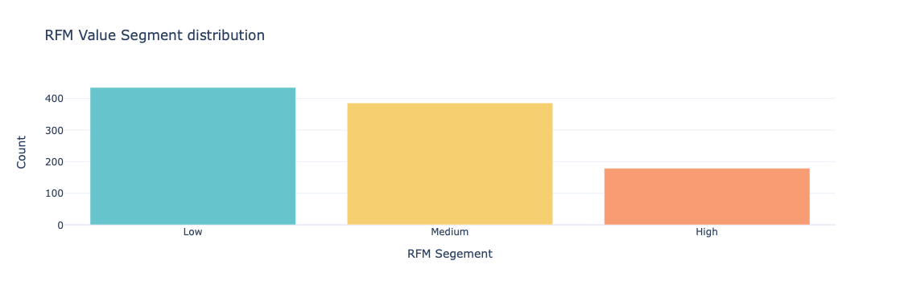
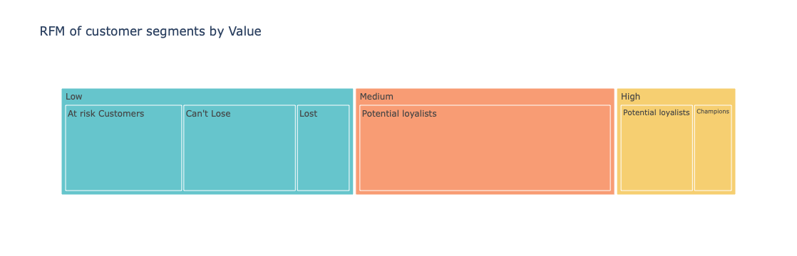
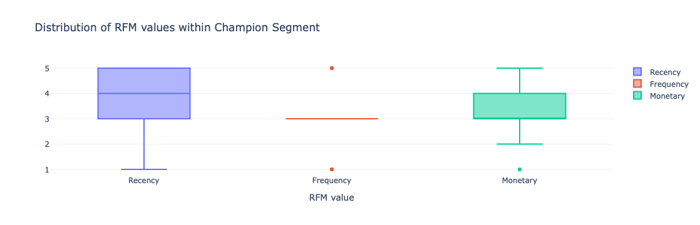
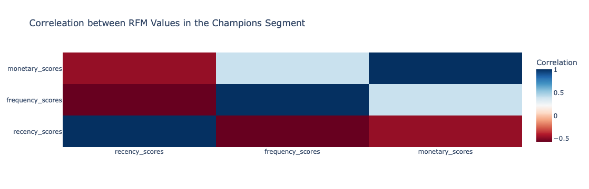
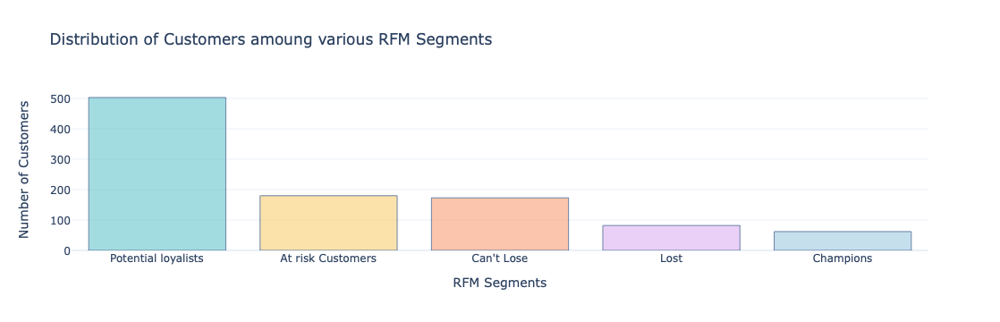
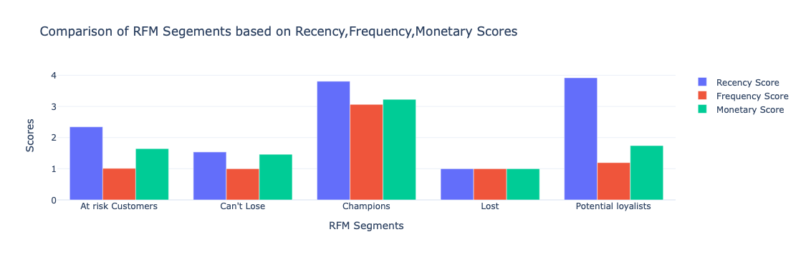

# 📊 Customer Segmentation with RFM Analysis

## Project Overview
This project demonstrates a comprehensive RFM (Recency, Frequency, Monetary) analysis for customer segmentation using Python. The analysis helps identify different customer segments based on their purchasing behavior, allowing for targeted marketing strategies.

## Dataset Information
The analysis uses a customer transaction dataset with the following columns:
- CustomerID: Unique identifier for each customer
- OrderID: Unique identifier for each order
- PurchaseDate: Date of purchase (parsed as datetime)
- TransactionAmount: Monetary value of the transaction

# 📊 Comprehensive Analysis of RFM Customer Segmentation Visualizations

## 1. RFM Value Segment Distribution

**Description**: This bar chart shows the distribution of customers across three value segments (Low, Medium, High) based on their RFM scores.

**Key Insights**:
- Medium value segment has the highest customer count
- High value segment shows substantial representation
- Low value segment has the fewest customers

**Business Implications**: The distribution indicates a healthy customer base with good potential for upselling Medium-value customers and retaining High-value customers.

## 2. RFM of Customer Segments by Value  - Treemap Visualization

**Description**: A treemap showing hierarchical relationship between value segments (Low, Medium, High) and detailed RFM segments.

**Key Segments Identified**:
- **High Value Segment**: Contains "Champions" (best customers)
- **Medium Value Segment**: Contains "Potential Loyalists" and "Can't Lose"
- **Low Value Segment**: Contains "At Risk Customers" and "Lost"

**Business Implications**: This visualization helps prioritize resource allocation - focus retention efforts on "Can't Lose" customers in Medium segment while nurturing "Potential Loyalists."

## 3. Distribution of RFM Values within Champion Segment 

**Description**: Box plot showing distribution of Recency, Frequency, and Monetary scores within the Champions segment.

**Key Insights**:
- Champions show high consistency in Frequency and Monetary scores
- Slightly wider variation in Recency scores
- All three RFM dimensions show high values (as expected for Champions)

**Business Implications**: Champions represent your most valuable customers with consistently high engagement across all dimensions.

## 4. Correlation between RFM Values in Champions Segment 

**Description**: Heatmap showing correlation between RFM dimensions within the Champions segment.

**Key Insights**:
- Frequency and Monetary scores show strong positive correlation (customers who buy often also spend more)
- Recency shows moderate correlation with other dimensions
- No negative correlations observed

**Business Implications**: The strong Frequency-Monetary relationship suggests that encouraging more frequent purchases may naturally increase spending.

## 5. Distribution of Customers among RFM Segments 

**Description**: Bar chart showing customer count across detailed RFM segments.

**Key Insights**:
- "Potential Loyalists" represent the largest segment
- "Champions" segment is substantial but smaller than Potential Loyalists
- "At Risk Customers" and "Can't Lose" segments need attention
- "Lost" customers represent the smallest segment

**Business Implications**: Focus on converting Potential Loyalists to Champions while implementing retention strategies for At Risk customers.

## 6. RFM Scores Comparison Across Segments 
**Description**: Grouped bar chart comparing average RFM scores across different segments.

**Key Insights**:
- Champions show highest scores across all three dimensions
- Potential Loyalists show strong performance but lower than Champions
- At Risk Customers show moderate scores but need attention
- Lost segment shows the lowest scores across all dimensions

**Business Implications**: This comparison helps understand the defining characteristics of each segment and tailor strategies accordingly.

## 🎯 Strategic Recommendations

### 1. For Champions (High Value):
- Implement exclusive loyalty programs
- Offer premium services and early access to new products
- Personalize communication based on purchase history

### 2. For Potential Loyalists (Medium Value):
- Develop targeted upsell campaigns
- Encourage higher purchase frequency through rewards
- Gather feedback to improve their experience

### 3. For At Risk Customers:
- Implement win-back campaigns with special offers
- Conduct surveys to understand why they're disengaging
- Reactivate through personalized recommendations

### 4. For Can't Lose Customers:
- Develop aggressive retention strategies
- Offer significant value-added services
- Assign dedicated account management if feasible

### 5. For Lost Customers:
- Evaluate cost-effectiveness of reacquisition
- Consider low-cost nurturing campaigns
- Analyze reasons for churn to prevent future losses

# 📊 Conclusion: RFM Customer Segmentation Analysis

## 🎯 Key Findings Summary

This comprehensive RFM (Recency, Frequency, Monetary) analysis has successfully segmented customers into distinct behavioral groups, revealing valuable insights about your customer base:

1. **Healthy Customer Distribution**: Your customer base shows a well-balanced distribution across value segments, with Medium-value customers representing the largest group, followed by substantial High-value segments.

2. **Clear Segmentation Patterns**: The analysis identified five distinct customer segments:
   - **Champions**: Your best customers who engage frequently and spend significantly
   - **Potential Loyalists**: Strong candidates for conversion to Champions
   - **At Risk Customers**: Previously engaged customers showing signs of disengagement
   - **Can't Lose**: High-value customers needing retention efforts
   - **Lost**: Minimally engaged customers

3. **Strong Correlation Patterns**: The identified strong positive correlation between Frequency and Monetary values among Champions indicates that purchase frequency drives revenue growth.

## 💡 Strategic Value

This RFM analysis provides a powerful framework for:

- **Targeted Marketing**: Precisely segment customers for personalized campaigns
- **Resource Optimization**: Allocate resources efficiently to segments with highest potential
- **Customer Retention**: Identify at-risk customers before they churn
- **Revenue Growth**: Develop strategies to move customers up the value ladder
- **Product Development**: Understand purchasing patterns to inform product offerings

## 🚀 Recommended Action Plan

### Immediate Actions (0-3 months):
1. Implement loyalty programs for Champions to maintain their engagement
2. Launch targeted upsell campaigns for Potential Loyalists
3. Develop win-back campaigns for At Risk Customers

### Medium-term Initiatives (3-6 months):
1. Create personalized communication strategies for each segment
2. Develop segment-specific product offerings and promotions
3. Establish ongoing RFM monitoring and reporting

### Long-term Strategy (6-12 months):
1. Integrate RFM segmentation into all customer touchpoints
2. Develop predictive models based on RFM patterns
3. Create automated marketing workflows for each segment

## 📈 Measurement of Success

Track these KPIs to measure the effectiveness of your RFM-based strategies:
- Customer lifetime value by segment
- Segment migration rates (customers moving to higher value segments)
- Retention rates by segment
- Revenue contribution by segment
- Campaign conversion rates by segment

## 🔮 Future Considerations

1. **Integration with Other Data**: Combine RFM with demographic and psychographic data for deeper insights
2. **Advanced Analytics**: Implement machine learning models for predictive segmentation
3. **Real-time Segmentation**: Develop systems for dynamic, real-time customer segmentation
4. **Cross-channel Integration**: Apply RFM insights across all customer touchpoints

This RFM analysis provides a solid foundation for data-driven customer relationship management that can significantly improve marketing effectiveness, customer retention, and revenue growth. The insights gained should be regularly updated and integrated into your ongoing business strategies for continuous improvement.

